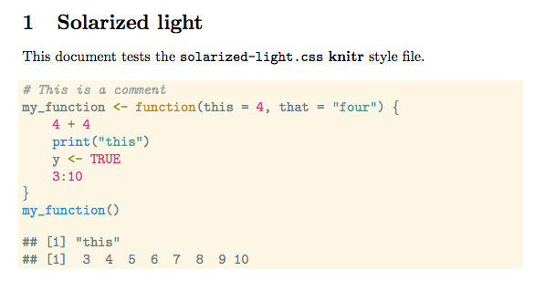
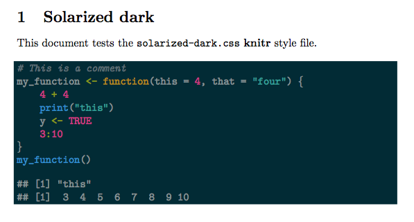

# Solarized knitr style files

The built-in [knitr](http://yihui.name/knitr) [Solarized](http://ethanschoonover.com/solarized) style files are quite basic. I've been experimenting with improved versions.

This repository has my versions of the light and dark Solarized theme files:





To use them yourself, download the `.css` files, place them in your working directory, and add a code chunk at the beginning of your knitr TeX document like this:

```
<<set-knitr-options, cache=FALSE, echo=FALSE>>=
library("knitr")
opts_chunk$set(dev = 'pdf')
opts_knit$set(out.format = "latex")
thm = knit_theme$get("solarized-dark.css")
knit_theme$set(thm)
@
```

See the files `solarized-dark.Rnw` and `solarized-light.Rnw` for example documents testing the two `.css` files. See the output files `solarized-dark.pdf` and `solarized-light.pdf` for the output.

For more information on the Solarized theme itself, see the main website:
<http://ethanschoonover.com/solarized>

and the main GitHub repository:
<https://github.com/altercation/solarized>

Note that you'll need a recent version of knitr (>= 1.5), since the style names were changed recently.
